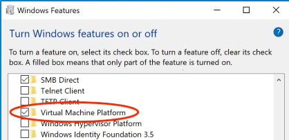
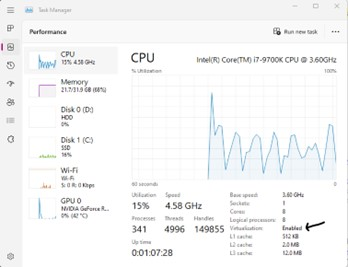
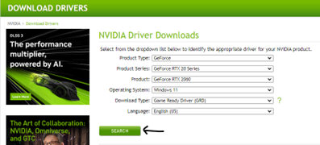
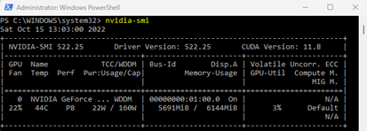
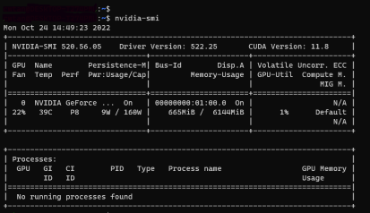
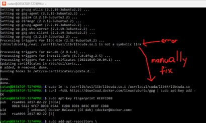

Here are the steps I used in setting up WSL to run nvidia-docker. It may or may not work on you.  Note this only works on Windows 11 build 22621 or newer.

1. Enable Virtual Machine Feature WITHOUT using Code. To enable Virtual machine feature without code, do the following
- Click on windows icon and search for control panel. Open control panel
- Click on Programs
- Under Programs, click on “Turn windows features on or off“
- Scroll down to “Virtual Machine Feature“, Click on it, then click OK.

2. Visualization must be turned on. This is done at the hardware BIOS level. Control+Alt+Delete (Task Manager -> Performance tab). 
- Refer to this link for details: https://support.microsoft.com/en-us/windows/enable-virtualization-on-windows-11-pcs-c5578302-6e43-4b4b-a449-8ced115f58e1
- Refer to the sample example. [Motherboard] How to enable Intel(VMX) Virtualization Technology in the BIOS: https://www.asus.com/support/FAQ/1043786/
<br>
3. Install WSL CUDA driver: https://docs.nvidia.com/cuda/wsl-user-guide/index.html#installing-nvidia-drivers  (the filename is something like `510.06_gameready_win11_win10-dch_64bit_international`) - this driver works for both WSL as well as native windows. After install make sure you can do `nvidia-smi`
- Execute <b>1. NVIDIA GPU Accelerated Computing on WSL 2</b>
- Execute <b>1.1. NVIDIA Compute Software Support on WSL 2</b>
- Execute <b>2. Getting Started with CUDA on WSL 2</b>
- Execute <b>2.1. Step 1: Install NVIDIA Driver for GPU Support</b>
<br>

4. Install WSL with Ubuntu Distro:  https://docs.nvidia.com/cuda/wsl-user-guide/index.html#installing-nvidia-drivers. Follow these steps from the link:
- Execute <b>2. Getting Started with CUDA on WSL 2</b>
- Execute <b>2.2. Step 2: Install WSL 2</b>
- Execute <b>2.3. Step 3: Set Up a Linux Development Environment</b>
5. Inside WSL Ubuntu distro, check if you can do `nvidia-smi`. There is no need to install any driver inside Ubuntu distro.
<br><b>Run Windows Powershell:</b>
<br>
<br><b>Start Ubuntu 20.04 and run:</b>
<br>
6. Installation of Linux x86 CUDA Toolkit using WSL-Ubuntu Package – Recommended. https://docs.nvidia.com/cuda/wsl-user-guide/index.html#installing-nvidia-drivers. Follow these steps from the link:
- Once a Windows NVIDIA GPU driver is installed on the system, CUDA becomes available within WSL 2. The CUDA driver installed on Windows host will be stubbed inside the WSL 2 as libcuda.so, therefore users must not install any NVIDIA GPU Linux driver within WSL 2. One has to be very careful here as the default CUDA Toolkit comes packaged with a driver, and it is easy to overwrite the WSL 2 NVIDIA driver with the default installation. Follow step 3 below is enough.
- Execute <b>3. CUDA Support for WSL 2 Option 1: Installation of Linux x86 CUDA Toolkit using WSL-Ubuntu Package – Recommended.</b> Start Ubuntu 20.04 and run:
```bash
$ sudo apt-key del 7fa2af80
$ wget https://developer.download.nvidia.com/compute/cuda/repos/wsl-ubuntu/x86_64/cuda-wsl-ubuntu.pin
$ sudo mv cuda-wsl-ubuntu.pin /etc/apt/preferences.d/cuda-repository-pin-600
$ wget https://developer.download.nvidia.com/compute/cuda/11.8.0/local_installers/cuda-repo-wsl-ubuntu-11-8-local_11.8.0-1_amd64.deb
$ sudo dpkg -i cuda-repo-wsl-ubuntu-11-8-local_11.8.0-1_amd64.deb
$ sudo cp /var/cuda-repo-wsl-ubuntu-11-8-local/cuda-*-keyring.gpg /usr/share/keyrings/
$ sudo apt-get update
$ sudo apt-get -y install cuda
```
7. Install NVidia docker support in WSL ubuntu distro using this guide: https://docs.nvidia.com/ai-enterprise/deployment-guide/dg-docker.html#enabling-the-docker-repository-and-installing-the-nvidia-container-toolkit
- Execute <b>INSTALLING DOCKER:</b>

```bash
Update the apt package index with the command below:
$ sudo apt-get update

Install packages to allow apt to use a repository over HTTPS:
$ sudo apt-get install -y \
    apt-transport-https \
    ca-certificates \
    curl \
    gnupg-agent \
    software-properties-common
```
At this point, the installation might encounter the following error:
<br>
```bash
Perform this step only if there is error above:
$ sudo ln -s /usr/lib/wsl/lib/libcuda.so.1 /usr/local/cuda/lib64/libcuda.so
```
Refer link to the fixing above: https://github.com/microsoft/WSL/issues/5663

```bash
Next you will need to add Docker’s official GPG key with the command below:
$ curl -fsSL https://download.docker.com/linux/ubuntu/gpg | sudo apt-key add -

Verify that you now have the key with the fingerprint 9DC8 5822 9FC7 DD38 854A E2D8 8D81 803C 0EBF CD88, by searching for the last 8 characters of the fingerprint:
$ sudo apt-key fingerprint 0EBFCD88

pub   rsa4096 2017-02-22 [SCEA]
    9DC8 5822 9FC7 DD38 854A  E2D8 8D81 803C 0EBF CD88
uid           [ unknown] Docker Release (CE deb) <docker@docker.com>
sub   rsa4096 2017-02-22 [S]

Use the following command to set up the stable repository:
$ sudo add-apt-repository \
"deb [arch=amd64] https://download.docker.com/linux/ubuntu \
$(lsb_release -cs) \
stable"

Install Docker Engine:
$ sudo apt-get update
$ sudo apt-get install -y docker-ce docker-ce-cli containerd.io

Verify that Docker Engine - Community is installed correctly by running the hello-world image:
$ sudo docker run hello-world
```
8. Install Docker container: https://docs.nvidia.com/ai-enterprise/deployment-guide/dg-docker.html#enabling-the-docker-repository-and-installing-the-nvidia-container-toolkit
- Execute <b>ENABLING THE DOCKER REPOSITORY AND INSTALLING THE NVIDIA CONTAINER TOOLKIT:</b> 

```bash
Add the package repositories:
$ distribution=$(. /etc/os-release;echo $ID$VERSION_ID)
$ curl -s -L https://nvidia.github.io/nvidia-docker/gpgkey | sudo apt-key add -
$ curl -s -L https://nvidia.github.io/nvidia-docker/$distribution/nvidia-docker.list | sudo tee /etc/apt/sources.list.d/nvidia-docker.list

Download information from all configured sources about the latest versions of the packages and install the nvidia-container-toolkit package:
$ sudo apt-get update && sudo apt-get install -y nvidia-container-toolkit
Restart the Docker service:
$ sudo systemctl restart docker

## test your nvidia docker 
$ sudo docker run --rm --gpus all nvidia/cuda:11.0.3-base-ubuntu20.04 nvidia-smi
```
9. Run a Tensorflow container: https://www.tensorflow.org/install
- Execute all steps under "Run a TensorFlow container"

```bash
 sudo docker pull tensorflow/tensorflow:latest  # Download latest stable image
 sudo docker run -it -p 8888:8888 -p 6006-6015:6006-6015 tensorflow/tensorflow:latest-jupyter # Start Jupyter server
 
 Note: port 6006-6015 are reserved for tensorboard. In the jypyter notebook, MUST use –bind all:
%tensorboard --logdir {logdir}/sizes --bind_all
```